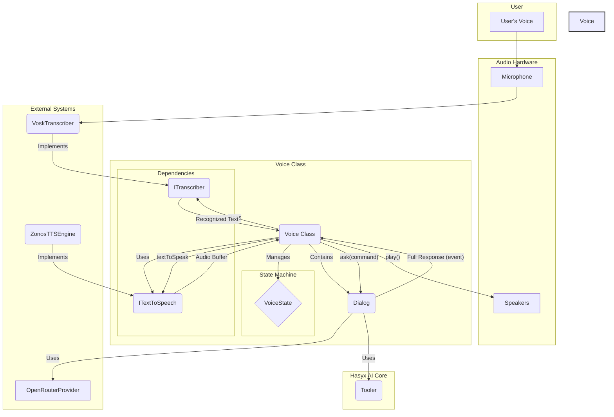

# САМОЕ ВАЖНОЕ - ВСЕ ДОЛЖНО БЫТЬ РЕАЛИЗОВАНО В РАМКАХ ТОЛЬКО 2 ФАЙЛОВ: voice.ts и voice-device.ts


# План интеграции голосового ассистента

Этот документ описывает шаги, необходимые для рефакторинга и интеграции функционала голосового ассистента (`lib/voice.ts` и `lib/voice-device.ts`) в текущую событийно-ориентированную AI-архитектуру Hasyx.

## 🎯 Основная цель

Основная цель рефакторинга — привести `voice.ts` в соответствие с архитектурой, основанной на классах `Dialog`, `AIProvider` и `Tooler`. Это позволит централизовать управление диалогом, унифицировать использование инструментов (кода и терминала) и упростить дальнейшую поддержку.

## ❗ Ключевые проблемы текущей реализации

1.  **Отсутствие `Dialog`**: `voice.ts` напрямую работает с `OpenRouterProvider`, реализуя собственную логику управления состоянием диалога, что дублирует функционал `Dialog`.
2.  **Нерабочие инструменты**: В системном промпте описан формат вызова инструментов (`> 😈...`), но в коде отсутствует механизм их парсинга и выполнения (который реализован в `Tooler`).
3.  **Устаревший формат команд**: Формат команд в промпте (`.../do/exec/js`) не соответствует тому, который ожидают текущие инструменты (`.../javascript/exec`).
4.  **Ручное управление потоком**: Логика парсинга ответа для TTS (теги `<VOICE>`) смешана с логикой получения ответа от AI, что усложняет код.

---

## 📝 План рефакторинга `lib/voice.ts`

### Шаг 1: Интеграция `Dialog`

Необходимо заменить прямое использование `OpenRouterProvider` на `Dialog`.

**1.1. Добавить `Dialog` в класс `Voice`:**

```typescript
// lib/voice.ts

// ... импорты
import { Dialog, DialogEvent } from './ai/dialog';
import { ExecJSTool } from './ai/tools/exec-js-tool';
import { TerminalTool } from './ai/tools/terminal-tool';
import { createSystemPrompt } from './ai/core-prompts';

class Voice {
    // ... существующие поля
    private dialog?: Dialog; // Добавить экземпляр Dialog
    
    // ... конструктор
}
```

**1.2. Инициализировать `Dialog`:**

Создайте новый метод `initializeDialog` или добавьте логику в `initialize`, где будет создаваться `Dialog` со всеми необходимыми компонентами.

```typescript
// lib/voice.ts

public async initialize(): Promise<void> {
    // ... существующая логика
    this.initializeDialog(); // Вызвать инициализацию
    // ...
}

private initializeDialog(): void {
    if (!this.aiProvider) {
        throw new Error("AI Provider не инициализирован.");
    }

    // 1. Создаем экземпляры инструментов
    const tools = [
        new ExecJSTool(),
        new TerminalTool({ timeout: 30000 })
    ];

    // 2. Создаем системный промпт с помощью хелпера
    // (потребуется обновить сам промпт, см. Шаг 3)
    const systemPrompt = this.getUpdatedSystemPrompt(tools);

    // 3. Создаем Dialog
    this.dialog = new Dialog({
        provider: this.aiProvider,
        tools: tools,
        systemPrompt: systemPrompt,
        onChange: this.handleDialogEvent.bind(this), // Привязываем обработчик событий
    });
}

// Новый метод для обработки событий
private handleDialogEvent(event: DialogEvent): void {
    // Логика обработки событий будет здесь (см. Шаг 4)
    console.log(`[Dialog Event] ${event.type}`);
}
```

### Шаг 2: Обновление системного промпта

Текущий промпт использует устаревший формат команд. Его нужно обновить.

**2.1. Создать метод для генерации промпта:**

```typescript
// lib/voice.ts

private getUpdatedSystemPrompt(tools: (ExecJSTool | TerminalTool)[]): string {
    const appContext = `You are a voice assistant named "${this.name}". The user addresses you by this name.
We are working together on this project.

**Communication Guidelines:**
- Always use "we" when referring to our work together.
- Keep responses concise for the voice interface.

**Voice Interface Rules:**
- Your full, detailed response will be processed by a secondary AI to create a concise summary for voice playback.
- Focus on providing the best and most complete answer; the secondary AI will handle adapting it for voice.
`;

    // Получаем описания инструментов автоматически
    const toolDescriptions = tools.map(tool => tool.contextPreprompt);

    // Используем стандартный хелпер для создания промпта
    return createSystemPrompt(appContext, toolDescriptions);
}
```

**2.2. Обновить формат команд в промпте `voice.ts`:**

Промпт в `voice.ts` содержит старый формат. **Это больше не нужно будет делать вручную**, так как `createSystemPrompt` и `tool.contextPreprompt` соберут правильный промпт автоматически. Старые примеры нужно удалить.

### Шаг 3: Рефакторинг метода `ask`

Метод `ask` должен быть максимально простым — его задача просто передать запрос в `Dialog`.

```typescript
// lib/voice.ts

public async ask(command: string): Promise<string> {
    this.interruptCurrentProcess();
    this.isProcessing = true;
    this.currentAbortController = new AbortController();

    if (!this.dialog) {
        throw new Error("Dialog не инициализирован.");
    }
    
    console.log('\n🤖 Отправляю команду в Dialog...');
    
    // Просто отправляем команду в Dialog.
    // Вся дальнейшая обработка будет в handleDialogEvent
    this.dialog.ask({ role: 'user', content: command });

    // Метод теперь может ничего не возвращать или возвращать Promise,
    // который будет разрешен в обработчике события 'done'.
    // Для простоты пока сделаем его void.
    return new Promise((resolve) => {
        // Этот Promise будет разрешен, когда придет событие 'done'
        const originalOnChange = this.dialog!.onChange;
        this.dialog!.onChange = (event: DialogEvent) => {
            originalOnChange(event);
            if (event.type === 'done' || event.type === 'error') {
                this.dialog!.onChange = originalOnChange; // Восстанавливаем
                resolve(event.type);
            }
        };
    });
}
```

### Шаг 4: Реализация обработчика событий `handleDialogEvent`

Это центральная часть рефакторинга. Вся логика, которая раньше была в `ask`, переезжает сюда.

**Почему `Voice` нужен собственный обработчик, а не повторное использование логики `ask`?**

Это ключевой архитектурный момент. Хотя `ask` (в `lib/ai/terminal.ts`) тоже обрабатывает события `Dialog`, его цель — просто вывести лог в консоль. У класса `Voice` задачи сложнее — он должен **реагировать** на события для управления своим состоянием и рабочим циклом:

-   **`ai_response`**: Это главный триггер. Здесь `Voice` должен взять полный ответ от "Агента-эксперта" и передать его "Агенту-диктору" для получения краткой версии для озвучивания.
-   **`done` / `error`**: `Voice` должен сбросить свой внутренний флаг `isProcessing` и вернуться в режим ожидания ключевого слова.
-   **`tool_call`**: В будущем здесь можно проигрывать звуковой сигнал, информирующий пользователя о начале выполнения действия.

Таким образом, `Voice` использует события не для логирования, а для **оркестрации своего сложного жизненного цикла**.

```typescript
// lib/voice.ts

private async handleDialogEvent(event: DialogEvent): Promise<void> {
    switch (event.type) {
        case 'ai_chunk': {
            // Выводим "мысли" AI (полный ответ) в консоль в реальном времени
            process.stdout.write(event.chunk);
            break;
        }

        case 'ai_response': {
            // Полный ответ от "Агента-эксперта" получен.
            console.log('\n✅ Полный ответ нейросети получен. Отправляю для подготовки к озвучиванию...');
            
            // Шаг 1: Отправляем полный ответ второму AI (Агенту-диктору)
            const textToSpeak = await this.getSpeakableResponse(event.content);
            
            // Шаг 2: Озвучиваем результат
            if (textToSpeak) {
                await this.speak(textToSpeak);
            }
            break;
        }

        case 'tool_call': {
            console.log(chalk.cyan(`\n[TOOL CALL] Вызываю инструмент: ${event.name} с командой: ${event.command}`));
            // Выполнение произойдет автоматически через Tooler
            break;
        }

        case 'tool_result': {
            console.log(chalk.magenta(`\n[TOOL RESULT] Результат от ${event.id}:`), event.result);
            break;
        }

        case 'done': {
            console.log('\n✅ Обработка команды завершена.');
            this.isProcessing = false;
            break;
        }

        case 'error': {
            console.error(chalk.red(`\n❌ Ошибка в диалоге: ${event.error}`));
            this.isProcessing = false;
            // Можно добавить озвучивание сообщения об ошибке
            await this.speak("Произошла ошибка. Пожалуйста, попробуйте еще раз.");
            break;
        }
    }
}

// Хелпер для вызова второго AI-диктора
private async getSpeakableResponse(fullText: string): Promise<string | null> {
    // Здесь будет логика вызова второго, легковесного AI
    // с промптом для суммаризации.
    // Например:
    // const announcerPrompt = `Преобразуй следующий текст в краткую голосовую реплику: ${fullText}`;
    // const response = await this.announcerAI.ask(announcerPrompt);
    // return response;
    
    // Временный mock:
    console.log("[DEBUG] Второй AI пока не реализован. Возвращаем mock-ответ.");
    return "Задача выполнена.";
}
```

---

## 🔬 Анализ использования пакета `zonosjs`

**Что такое `zonosjs`?**

Судя по коду и поиску, `zonosjs` — это клиент и сервер для высококачественного синтеза речи (Text-to-Speech) с возможностью клонирования голоса. Он работает локально, что обеспечивает приватность и низкую задержку. Для работы он требует референсный аудиофайл (`reference.wav`), на основе которого генерируется речь.

**Как он используется в `lib/voice.ts`?**

Использование в проекте довольно продвинутое и состоит из нескольких шагов:

1.  **Управление сервером**: Код проверяет, запущен ли уже сервер `zonosjs` на порту 5000. Если да, он принудительно его останавливает, чтобы избежать конфликтов.
2.  **Запуск сервера**: Запускается локальный бинарный файл `zonosjs` из `node_modules` как отдельный процесс. Это превращает Hasyx в менеджер для TTS-сервера.
3.  **Ожидание готовности**: Код периодически "пингует" сервер, чтобы дождаться его полной готовности к приему запросов.
4.  **Динамический импорт**: Клиентская часть `zonosjs` импортируется динамически, что является гибким подходом.
5.  **Генерация речи**: Вызывается метод `client.generateSpeech()` с текстом и путем к референсному аудио.
6.  **Сохранение результата**: Сгенерированный аудиофайл сохраняется как `output_zonos.wav`.

**Оценка использования:**

Использование **выглядит корректным и логичным** для поставленной задачи — локального и качественного синтеза речи.

-   **Надежность**: Механизмы проверки и перезапуска сервера делают систему более отказоустойчивой.
-   **Гибкость**: Использование референсного аудио позволяет легко менять голос ассистента.
-   **Зависимости**: Такой подход создает сильную зависимость от конкретной структуры проекта (`zonosjs-test`) и локально установленного пакета `zonosjs`. Это не является проблемой для персонального проекта, но потребовало бы доработки для распространения.

**Что нужно добавить?**

-   **Воспроизведение аудио**: В текущем коде сгенерированный `.wav` файл только сохраняется. Необходимо добавить шаг для его немедленного воспроизведения через `AudioDeviceManager`, чтобы пользователь мог услышать ответ.

---

## 🏛️ Архитектурные улучшения (на основе файла критики)

Этот раздел дополняет первоначальный план рефакторинга, предлагая более глубокие архитектурные улучшения, основанные на критическом анализе. Эти идеи можно реализовать после выполнения базового плана для повышения надежности, гибкости и качества работы ассистента.

### 1. Управление состоянием через конечный автомат (State Machine)

**Проблема (из критики):** Управление состоянием через разрозненные булевы флаги (`isProcessing`, `isListening`) — хрупкое и ведет к потенциальным гонкам состояний.

**Решение:** Ввести явный конечный автомат для управления жизненным циклом ассистента.

1.  **Определить состояния**:
    ```typescript
    export enum VoiceState {
        IDLE,                  // Ресурсы не захвачены
        INITIALIZING,          // Идет инициализация
        LISTENING_FOR_KEYWORD, // Ожидание ключевого слова
        RECORDING_COMMAND,     // Идет запись команды
        AWAITING_AI_RESPONSE,  // Ожидание ответа от Dialog
        SPEAKING,              // Синтез и воспроизведение речи
        DESTROYING,            // Освобождение ресурсов
    }
    ```
2.  **Централизовать состояние**: Заменить все флаги на одно свойство `private state: VoiceState`.
3.  **Управлять переходами**: Все публичные методы (`initialize`, `startListening`, `interrupt`, `destroy`) и внутренние обработчики (`handleDialogEvent`) должны управлять переходами между этими состояниями. Например, `interrupt` всегда будет принудительно переводить состояние в `LISTENING_FOR_KEYWORD`, выполняя необходимые действия по очистке.

### 2. Строгий жизненный цикл и API

**Проблема (из критики):** Отсутствие четких методов для управления ресурсами (`initialize`/`destroy`), что может привести к утечкам или конфликтам.

**Решение:** Определить строгий API для управления жизненным циклом.

-   **`async initialize()`**: Единственный метод, который захватывает системные ресурсы (аудиоустройства, порты, процессы). Должен вызываться перед началом работы.
-   **`async destroy()`**: Единственный метод, который гарантированно освобождает все ресурсы.

Это сделает класс `Voice` предсказуемым и безопасным для использования в любом окружении.

### 3. Гибкая система генерации ответов (опциональный AI-диктор)

**Проблема (из критики):** Постоянное использование второго AI для подготовки ответов может быть медленным и дорогим.

**Решение:** Сделать эту функцию опциональной.

1.  **Добавить опцию**: В конструктор `Voice` добавляется флаг `useAnnouncerAI: boolean` (по умолчанию `false`).
2.  **Динамический промпт**: Системный промпт для основного AI будет меняться. Если `useAnnouncerAI` выключен, в промпт будет добавлена инструкция использовать теги `<VOICE>`. Если включен — эта инструкция будет опускаться.
3.  **Условная логика**: В обработчике `handleDialogEvent` при событии `ai_response` логика будет ветвиться:
    -   Если `useAnnouncerAI` включен, вызывается второй AI.
    -   Если выключен, используется простой и быстрый парсер тегов `<VOICE>`.

Это позволит разработчику выбирать между скоростью/стоимостью и качеством голосовых ответов в зависимости от задачи.

### 4. Гибкая замена STT/TTS через Dependency Injection

**Проблема:** Как позволить пользователям легко подменять реализации STT (распознавание речи) и TTS (синтез речи), не меняя код самого ассистента?

**Решение:** Вместо жесткой привязки к `Vosk` и `zonosjs`, мы будем использовать паттерн "Стратегия" и внедрение зависимостей (Dependency Injection).

1.  **Определить интерфейсы**:
    ```typescript
    export interface ITranscriber {
        initialize(): Promise<void>;
        start(onResult: (text: string) => void): Promise<void>;
        stop(): Promise<void>;
        destroy(): Promise<void>;
    }

    export interface ITextToSpeech {
        initialize(): Promise<void>;
        speak(text: string): Promise<void>;
        stop(): Promise<void>;
        destroy(): Promise<void>;
    }
    ```
2.  **Принимать реализации в конструкторе**:
    ```typescript
    class Voice {
        private transcriber: ITranscriber;
        private tts: ITextToSpeech;

        constructor(options: {
            // ...
            transcriber?: ITranscriber;
            tts?: ITextToSpeech;
        }) {
            this.transcriber = options.transcriber || new VoskTranscriber();
            this.tts = options.tts || new ZonosTTSEngine();
        }
    }
    ```
Это позволит пользователям передавать свои собственные классы для распознавания и синтеза речи, делая систему максимально расширяемой.

### 5. Конфигурируемая и предсказуемая инициализация

**Проблема:** Как избежать запуска ненужных "тяжелых" процессов (например, STT, если нужен только TTS) и при этом сохранить предсказуемую производительность без задержек во время работы?

**Решение:** Сохранить единый метод `initialize()`, но сделать его поведение конфигурируемым.

1.  **Добавить опции в конструктор**:
    ```typescript
    constructor(options: {
        enableTranscription?: boolean; // default true
        enableTTS?: boolean;           // default true
        // ...
    })
    ```
2.  **Условная инициализация**: Метод `initialize()` будет "жадно" (eagerly) запускать только те сервисы, которые были включены в конфигурации.
    ```typescript
    async initialize() {
        if (this.options.enableTranscription) {
            await this.transcriber.initialize();
        }
        if (this.options.enableTTS) {
            await this.tts.initialize();
        }
        // ... инициализация Dialog
    }
    ```
Это решает проблему изоляции на уровне конфигурации, сохраняя при этом предсказуемую производительность, так как все "долгие" запуски происходят один раз в начале работы.

---

## 🏗️ Итоговая архитектура

На основе всех обсуждений, итоговая архитектура голосового ассистента `Voice` будет выглядеть следующим образом.

### Текстовое описание

Класс `Voice` является центральным фасадом, который управляет всем жизненным циклом и взаимодействиями.

1.  **Конфигурация и зависимости**: При создании экземпляра `Voice` в него через конструктор передаются все зависимости и конфигурации:
    *   Реализации движков для распознавания речи (`ITranscriber`) и синтеза речи (`ITextToSpeech`). Если они не предоставлены, используются реализации по умолчанию (`VoskTranscriber`, `ZonosTTSEngine`).
    *   Конфигурации для AI (`apiKey`, `model`).
    *   Флаги для включения/отключения модулей (`enableTranscription`, `enableTTS`).

2.  **Жизненный цикл**: Управление состоянием происходит через строгий конечный автомат (`VoiceState`).
    *   Метод `initialize()` запускает все необходимые фоновые процессы (STT, TTS) и подготавливает систему к работе.
    *   Метод `destroy()` гарантированно останавливает все процессы и освобождает ресурсы.

3.  **Поток данных (Голос -> Текст -> AI -> Текст -> Голос)**:
    *   **Голос -> Текст**: `ITranscriber` (например, `Vosk`) захватывает аудиопоток, распознает ключевое слово, записывает команду и передает распознанный текст в `Voice`.
    *   **Текст -> AI**: `Voice` передает текстовую команду своему внутреннему экземпляру `Dialog`.
    *   **AI-обработка**: `Dialog` управляет взаимодействием с `AIProvider`, передает ему историю сообщений и команду. При необходимости `Dialog` использует `Tooler` для выполнения инструментов, запрошенных AI.
    *   **AI -> Текст**: `Dialog` возвращает итоговый текстовый ответ в `Voice` через событие `ai_response`.
    *   **(Опционально) Текст -> Текст**: Если включен режим `useAnnouncerAI`, `Voice` делает дополнительный запрос к "AI-диктору" для получения краткой версии ответа.
    *   **Текст -> Голос**: `Voice` передает финальный текст для озвучивания в `ITextToSpeech` (например, `ZonosTTSEngine`), который синтезирует аудио.
    *   **Воспроизведение**: Полученный аудио-буфер проигрывается через `AudioDeviceManager`.

### Блок-схема


